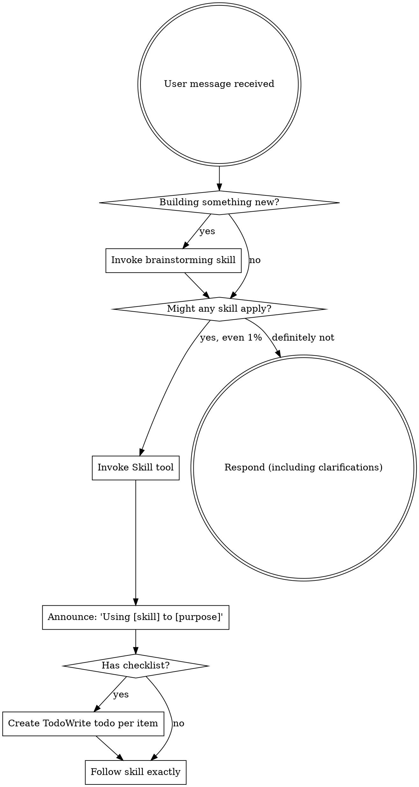

<SUBAGENT-STOP>
If you were dispatched as a subagent to execute a specific task, skip this skill.
</SUBAGENT-STOP>

<EXTREMELY-IMPORTANT>
If you think there is even a 1% chance a skill might apply to what you are doing, you ABSOLUTELY MUST invoke the skill.

IF A SKILL APPLIES TO YOUR TASK, YOU DO NOT HAVE A CHOICE. YOU MUST USE IT.

This is not negotiable. This is not optional. You cannot rationalize your way out of this.
</EXTREMELY-IMPORTANT>

## Instruction Priority

Elenchus skills override default system prompt behavior, but **user instructions always take precedence**:

1. **User's explicit instructions** (CLAUDE.md, AGENTS.md, direct requests) — highest priority
2. **Elenchus skills** — override default system behavior where they conflict
3. **Default system prompt** — lowest priority

If CLAUDE.md or AGENTS.md says "don't use TDD" and a skill says "always use TDD," follow the user's instructions. The user is in control.

## Codex Requirement

Elenchus requires `codex exec` for multi-perspective question generation and reviews. There is no fallback. Ensure the Codex CLI is installed and available in your PATH before using elenchus skills.

Question generation and design/plan/implementation reviews are executed via `codex exec` — not via subagents. This keeps the main Claude Code session clean and leverages a separate model for independent review.

## How to Access Skills

Use the `Skill` tool. When you invoke a skill, its content is loaded and presented to you — follow it directly. Never use the Read tool on skill files.

# Using Skills

## The Rule

**Invoke relevant or requested skills BEFORE any response or action.** Even a 1% chance a skill might apply means that you should invoke the skill to check. If an invoked skill turns out to be wrong for the situation, you don't need to use it.



## Skill Catalog

### Core Workflow (in order)

1. **elenchus:brainstorming** — Multi-perspective question generation via `codex exec`. Explores user intent through batched questions from 5 perspectives (Product, Security, Maintainability, UX, Architecture). Produces a Discovery Log and Design Doc.

2. **elenchus:writing-plans** — Creates bite-sized implementation plans from approved designs. Reviews plans via `codex exec` with fix loops until no Critical/Important issues remain.

3. **elenchus:subagent-driven-development** — Executes plans by dispatching fresh implementation workers (Agent tool) per task. Two-stage per-task review (spec compliance + code quality). Final multi-perspective implementation review via `codex exec`.

4. **elenchus:executing-plans** — Alternative to subagent-driven-development for separate-session execution with human checkpoints between batches.

### Supporting Skills

5. **elenchus:using-git-worktrees** — Creates isolated git worktrees for feature work. Auto-detects project setup, verifies clean test baseline.

6. **elenchus:finishing-a-development-branch** — Guides branch completion: verify tests, present 4 options (merge/PR/keep/discard), execute chosen workflow, clean up worktree.

### Typical Flow

```
brainstorming → writing-plans → using-git-worktrees → subagent-driven-development → finishing-a-development-branch
```

## Skill Priority

When multiple skills could apply, use this order:

1. **Process skills first** (brainstorming) — these determine HOW to approach the task
2. **Implementation skills second** — these guide execution

"Let's build X" → brainstorming first, then implementation skills.

## Red Flags

These thoughts mean STOP — you're rationalizing:

| Thought | Reality |
|---------|---------|
| "This is just a simple question" | Questions are tasks. Check for skills. |
| "I need more context first" | Skill check comes BEFORE clarifying questions. |
| "Let me explore the codebase first" | Skills tell you HOW to explore. Check first. |
| "I can check git/files quickly" | Files lack conversation context. Check for skills. |
| "Let me gather information first" | Skills tell you HOW to gather information. |
| "This doesn't need a formal skill" | If a skill exists, use it. |
| "I remember this skill" | Skills evolve. Read current version. |
| "This doesn't count as a task" | Action = task. Check for skills. |
| "The skill is overkill" | Simple things become complex. Use it. |
| "I'll just do this one thing first" | Check BEFORE doing anything. |
| "This feels productive" | Undisciplined action wastes time. Skills prevent this. |

## Skill Types

**Rigid** (brainstorming, writing-plans): Follow exactly. Don't adapt away discipline.

**Flexible** (using-git-worktrees): Adapt principles to context.

The skill itself tells you which.

## User Instructions

Instructions say WHAT, not HOW. "Add X" or "Fix Y" doesn't mean skip workflows.
